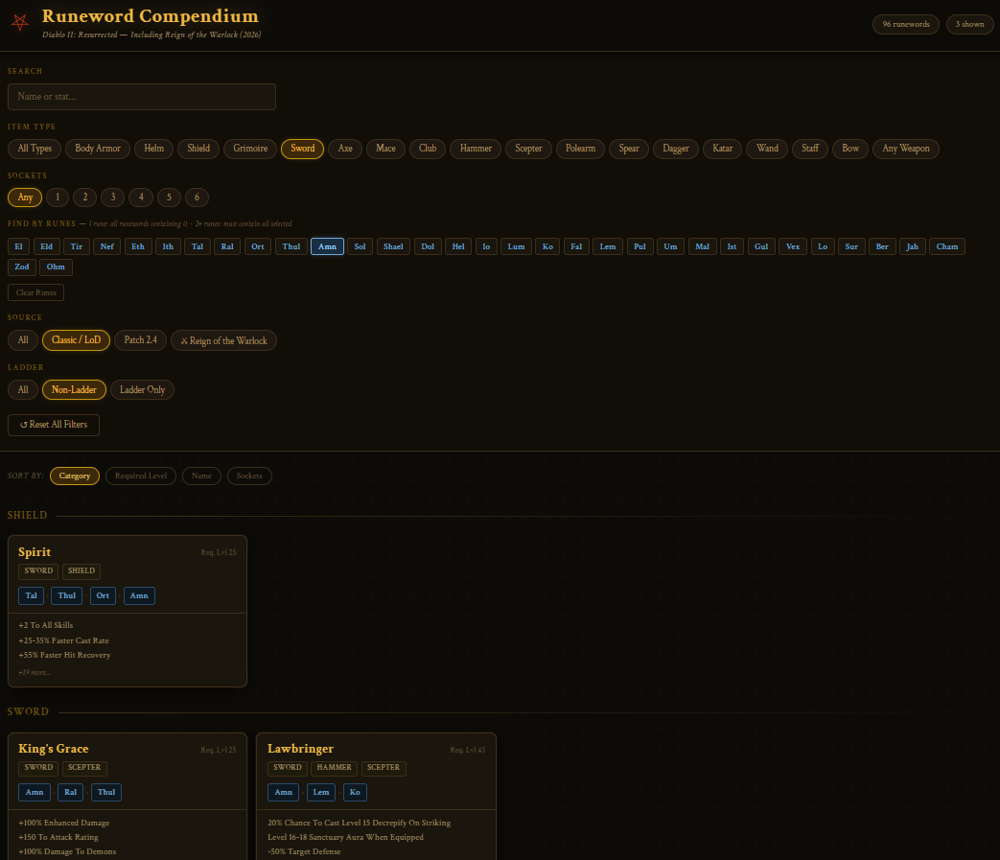

# d2-compendium

Diablo 2 Compendium (vibe coded)

Disclaimer: this is totally vibe coded. I didn't fact check the information if they are 100% correct. I will update if I found any incorrect info in the future as I go.

## Features

- Run completely local. No database, use json as storage.
- Rune words
  - Search by rune word, or *any* of the effect stats (e.g. you can search for "+2 to all skills") 
  - Filter by item type, by runes (one or more), or by number of sockets
  - Filter by game/expansion, or by ladder/non-ladder
  - Sort by required level, category, no. of socket, or name
- Item sets
  - Search by item name, or *any* of the effect stats (e.g. you can search for "+2 to all skills") 
  - Filter by tier, or by class
  - Filter by game/expansion, or by ladder/non-ladder
- More to be added

## To use

Download all the files and open index.html in a browser

## Why

- D2 just has a new hero class in 2026, it is time to play it again
- I want a local tool that can quickly find and filter information about D2

## Vibe coding

This is totally vibe coded using Claude Code Sonnet 4.6, done in about 30 mins (including some minor adjustments and putting them up in Github)
